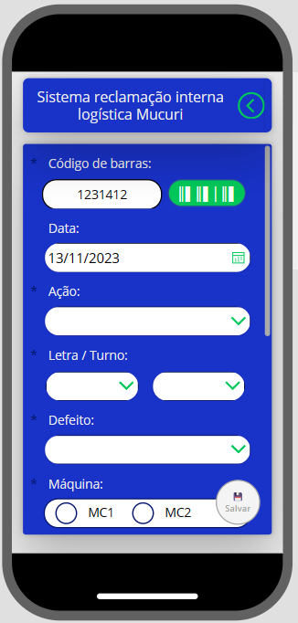
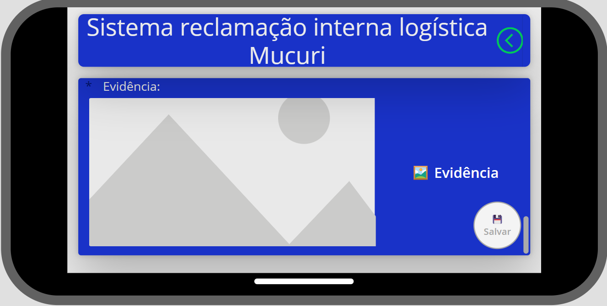

# PowerApps - Aplicativo registro de não conformidades

## Visão Geral

Este aplicativo PowerApps foi desenvolvido para atender às necessidades do setor logístico, especialmente para a equipe de recebimento. O aplicativo é responsivo, facilitando a utilização em diferentes dispositivos.

## Aviso DEV
Para usar este modelo no seu projeto é necessario uma conexa com banco de dados que foi removida do mesmo por motivos de seguraça.
Este app esta em uso na cidede de Mucuri-BA por na area de logistica.

## Funcionalidades Principais

1. **Responsividade:**
   - O aplicativo é projetado para funcionar de forma eficiente em vários dispositivos, incluindo smartphones, tablets e desktops.

2. **Leitor de Código de Barras:**
   - Integra um leitor de código de barras para facilitar a identificação e rastreamento de produtos.

3. **Registro de Avarias e Não Conformidades:**
   - Usuários da equipe logística no setor de recebimento podem registrar avarias ou não conformidades em produtos provenientes da produção.
   - Fornece campos específicos para detalhar a natureza da avaria e documentar informações relevantes.

## Como Usar

1. **Acesso:**
   - Faça login usando as credenciais fornecidas pela equipe de TI.

2. **Leitura de Código de Barras:**
   - Utilize a função de leitura de código de barras para escanear os códigos dos produtos recebidos.

3. **Registro de Avarias ou Não Conformidades:**
   - Preencha os campos necessários para documentar avarias ou não conformidades.
   - Anexe fotos, se necessário, para fornecer uma documentação visual.

4. **Responsividade:**
   - Aproveite a experiência responsiva em diferentes dispositivos para maior flexibilidade no uso.

## Requisitos do Sistema

- Navegador da web moderno
- Dispositivo com câmera para a funcionalidade de leitura de código de barras (em dispositivos móveis)

## Capturas de Tela

### Tablet (Modo Paisagem)

### Celular (Modo Retrato)

### Celular (Modo Paisagem)

## Autor

Juliano Batista Silva

